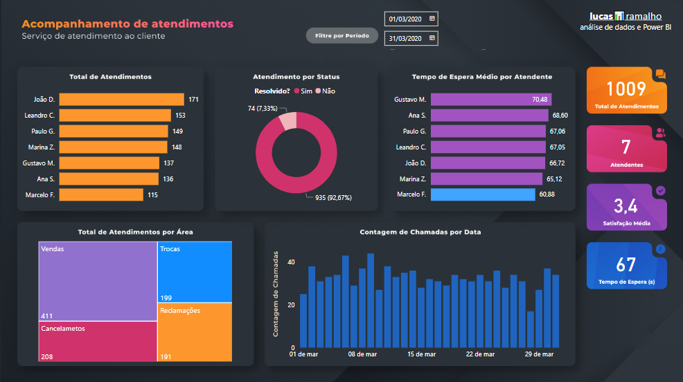
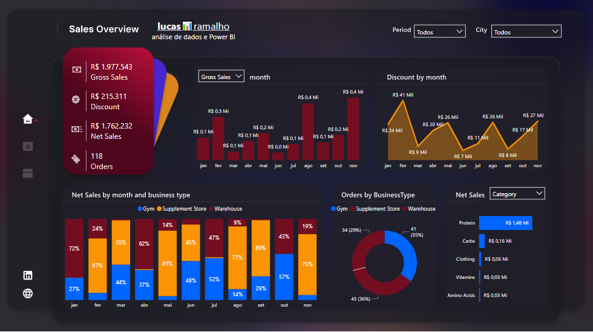
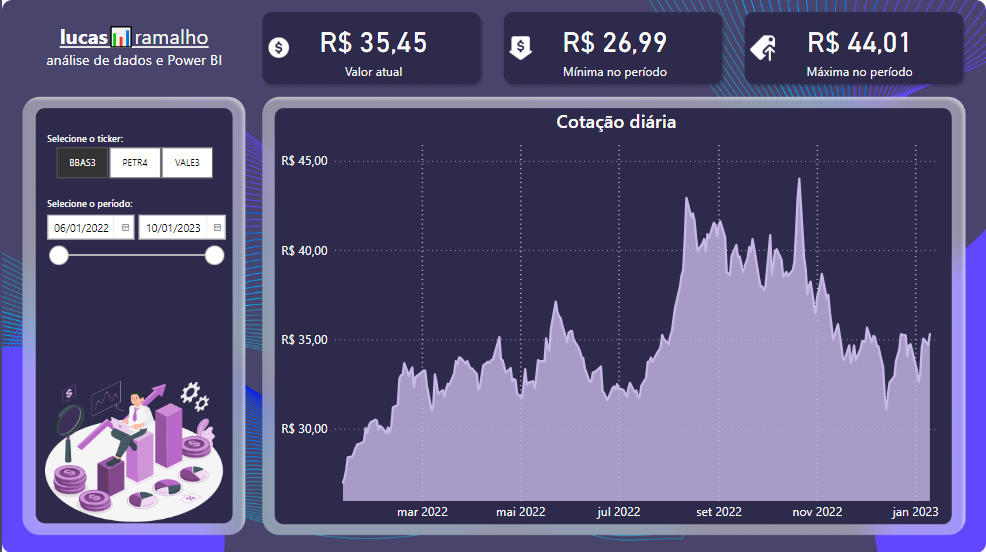
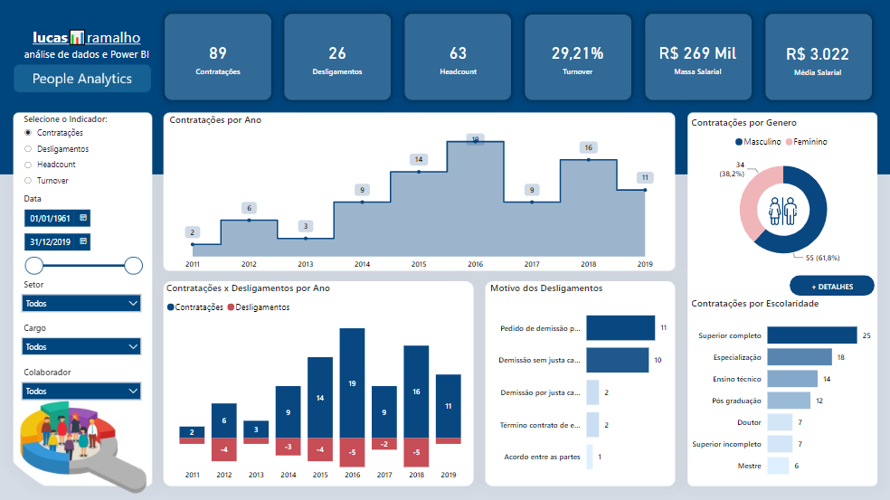
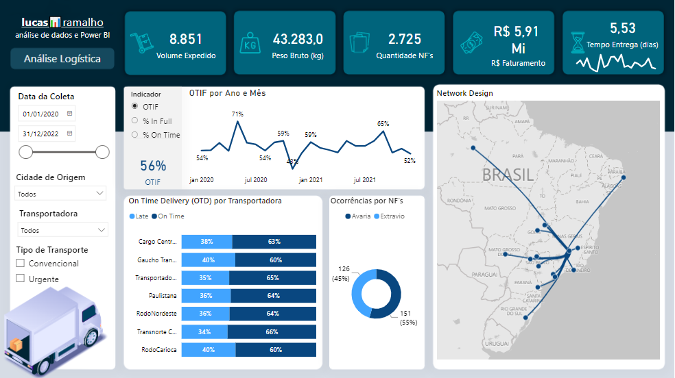
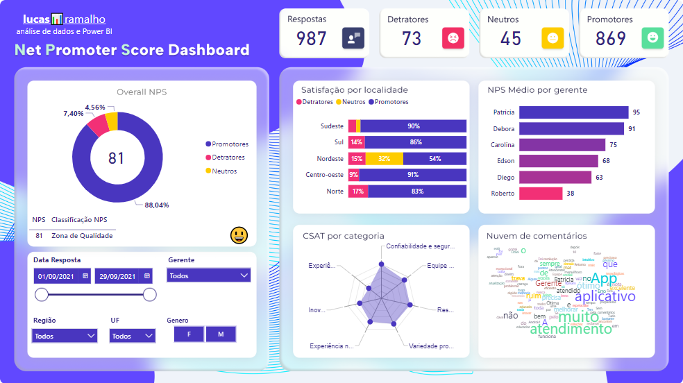
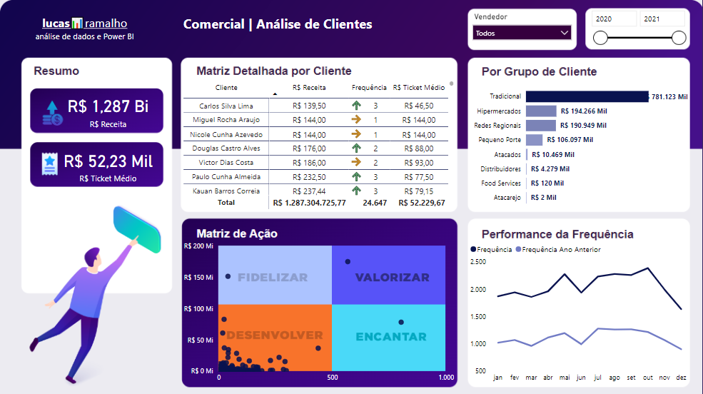
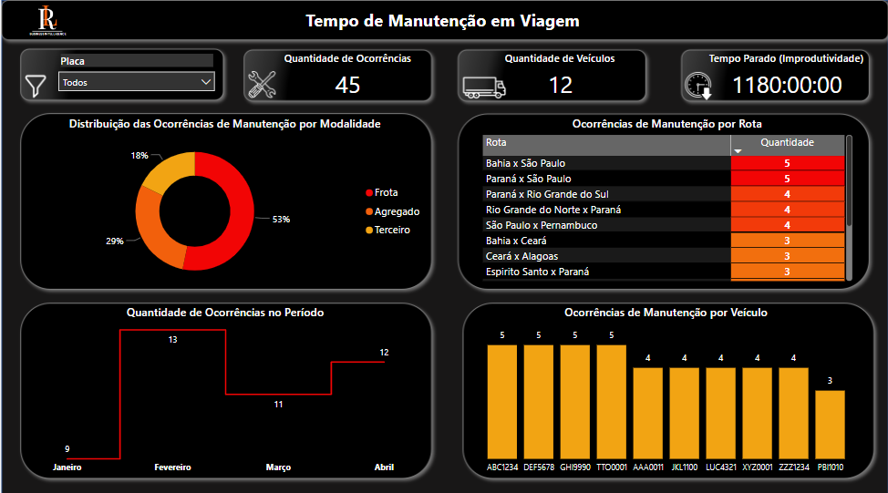

# Visualização de Dados com Power BI

## Atendimentos de Suporte & TI

Dashboard desenvolvido para monitorar os indicadores de performance referente a abertura de chamados para a área de suporte, através do mesmo podemos analisar:

  - Quantidade de atendimentos por Atendente.
  - Distribuição dos atendimentos por Resolução.
  - Tempo médio de espera por Atendente.
  - Quantidade de atendimentos por Área.
  - Quantidade de atendimentos por Dia.
  - Satisfação Média pós atendimento.

Veja esse dashboard 100% interativo e com mais detalhes no [Power BI](https://app.powerbi.com/view?r=eyJrIjoiMWRjNmU5NDItNTgxMS00MzIxLWE1MTYtYjVjNjkyMTI2NTM1IiwidCI6IjIxYzJkNDJlLWY2MTItNDZmNi1iOTBhLTEwY2YxODVmYmFkZiJ9).

## Performance de Vendas

Dashboard desenvolvido para realizar o acompanhamento de vendas de um Centro de Distribuição de Suplementos e Produtos Esportivos, através do mesmo podemos analisar:

  - Performance  da receita bruta ao longo do tempo.
  - Performance dos descontos realizados ao longo do tempo.
  - Performance da receita líquida ao longo do tempo.
  - Distribuição da receita líquida por tipo de negócio.
  - Distribuição da quantidade de pedidos por tipo de negócio.
  - Distribuição da receita líquida por categoria e subcategoria de produto.
  - Distribuição da receita líquida por Estado.

Veja esse dashboard 100% interativo e com mais detalhes no [Power BI](https://app.powerbi.com/view?r=eyJrIjoiN2Q5MzEzNjktYjk5YS00OTZjLWE2MTAtOTk1MTg5ZjQwOGVkIiwidCI6IjIxYzJkNDJlLWY2MTItNDZmNi1iOTBhLTEwY2YxODVmYmFkZiJ9).

## Acompanhamento de Ações - Bolsa de Valores

Dashboard desenvolvido para realizar o acompanhamento dos valores de Ações na Bolsa de Valores.
Utilizando script Python, com a biblioteca yfinance para obter os dados das ações, e o Power BI para apresentação visual das Análises, layout desenvolvido no Figma.

Veja esse dashboard 100% interativo e com mais detalhes no [Power BI](https://app.powerbi.com/view?r=eyJrIjoiOGE0MmQzNTEtY2VlNi00ZDJjLTgwNjEtMzdlOGFkYTY3OGFmIiwidCI6IjIxYzJkNDJlLWY2MTItNDZmNi1iOTBhLTEwY2YxODVmYmFkZiJ9&pageName=ReportSection).

## People Analytics

Dashboard desenvolvido como ferramenta de gestão a área de Recursos Humanos, contendo os principais indicadores da área:

  - Contratações.
  - Desligamentos.
  - Headcount (colaboradores ativos).
  - Turnover (rotatividade).
  - Massa salarial de toda empresa.
  - Média salarial de cada colaborador.

Veja esse dashboard 100% interativo e com mais detalhes no [Power BI](https://app.powerbi.com/view?r=eyJrIjoiN2ZmZGIyODUtYjQ2ZC00MjRmLTljNTUtNmI0NjUwZTZiZTc0IiwidCI6IjIxYzJkNDJlLWY2MTItNDZmNi1iOTBhLTEwY2YxODVmYmFkZiJ9&pageName=ReportSection).

## Performance Logística

Dashboard desenvolvido para analisar a performance logística, com os principais indicadores:

  - On Time In Full (OTIF) - Mensurar as entregas que foram realizadas dentro do prazo e sem ocorrências de transporte.
  - On Time Delivery (OTD) - Mensurar se a entrega ocorreu dentro ou fora do prazo estabelecido junto ao cliente.
  - In Full Delivery - Mensurar a qualidade das entregas (ocorrências de avaria ou extravio).

Veja esse dashboard 100% interativo e com mais detalhes no [Power BI](https://app.powerbi.com/view?r=eyJrIjoiZWU3NzZmNWYtNzFjMy00ZGQ2LThhZjAtODRjNjg2YTczNzA2IiwidCI6IjIxYzJkNDJlLWY2MTItNDZmNi1iOTBhLTEwY2YxODVmYmFkZiJ9).

## Customer Experience

Dashboard desenvolvido para analisar os resultados de uma pesquisa de satisfação do cliente, com os principais indicadores de Customer Experience:

  - NPS (Net Promoter Score) - Lealdade e Recomendação do Cliente, com relação ao produto ou serviço.
  - CSAT (Customer Satisfaction Score) - Satisfação do Cliente, com relação a algum tema em específico.

Veja esse dashboard 100% interativo e com mais detalhes no [Power BI](https://app.powerbi.com/view?r=eyJrIjoiM2M5NmNkZjMtYzIxYS00ZjdiLTljMzUtMDc1NzM0NDNjMDU4IiwidCI6IjIxYzJkNDJlLWY2MTItNDZmNi1iOTBhLTEwY2YxODVmYmFkZiJ9).

## Performance de Clientes

Dashboard desenvolvido para analisar a performance dos clientes, seja por recorrência de compra, ticket médio ou valor da compra.

Na Matriz de Ação, podemos identificar quais clientes estão em desenvolvimento, quais clientes devemos fidelizar, valorizar ou encantar.

Veja esse dashboard 100% interativo e com mais detalhes no [Power BI](https://app.powerbi.com/view?r=eyJrIjoiZjMzYzg5NTMtMzVkNy00ZTQ1LTkyMjAtNmJjNTNmZTBmYmJlIiwidCI6IjIxYzJkNDJlLWY2MTItNDZmNi1iOTBhLTEwY2YxODVmYmFkZiJ9).

## Produtividade da Frota

Dashboard desenvolvido para analisar ocorrências de manutenção de veículos com viagem em andamento, com a finalidade de verificar ativos mais reincidentes em ocorrências de manutenção e maior improdutividade.

Possuímos as seguintes análises:

  - Distribuição das ocorrências de manutenção por modalidade (frota, agregado ou terceiro).
  - Quantidade de ocorrências de manutenção por rota.
  - Quantidade de ocorrências de manutenção por mês.
  - Quantidade de ocorrências de manutenção por veículo.

Veja esse dashboard 100% interativo e com mais detalhes no [Power BI](https://app.powerbi.com/view?r=eyJrIjoiNzVmZjk1NmQtMzI0Ni00NGI0LWI2NjgtZTBlOWYzZGEwYWUzIiwidCI6IjIxYzJkNDJlLWY2MTItNDZmNi1iOTBhLTEwY2YxODVmYmFkZiJ9).

## Sobre o Desenvolvedor

Lucas Ramalho atua como Senior Data Analyst e Analytics Engineer, é formado em Analytics, Big Data e Inteligência Competitiva, atua com dados desde 2021 e já atuou em diferentes segmentos como Varejo, Logística, Indústria e Tecnologia.

Atua no desenvolvimento de soluções em dados para apoiar a tomada de decisão e melhorar o desempenho dos negócios ao utilizar os dados de forma eficiente e estratégica.

Possui forte experiência em Manipulação de dados, Pipelines de ETL/ELT, Modelagem de dados, Qualidade de dados, Documentação Técnica e Visualização de dados.

Conheça mais detalhes no [LinkedIn](https://www.linkedin.com/in/olucasramalho/).

Fique a vontade para se conectar nas redes sociais:

 
  
  
  

